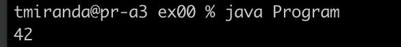
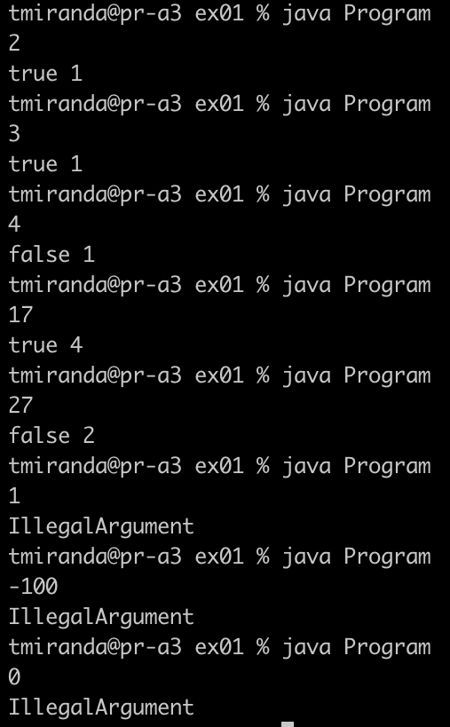
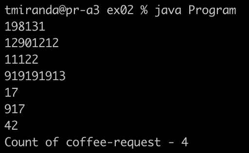
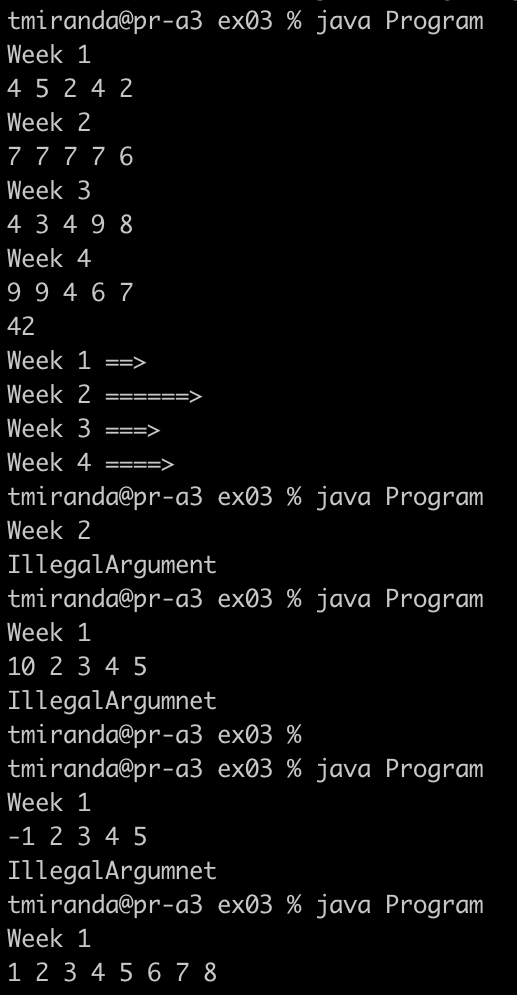
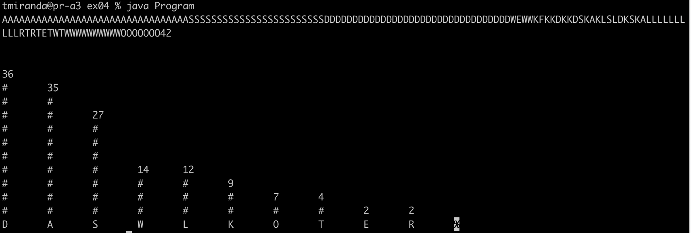

# Day00
1. ex00. Задача: сосчитать сумму цифр числа.
   Пример работы программы для номера 479598:

2. ex01. Задача: определить, является ли входное число простым и вывести количество совершенных итераций совершенных для определения.
   Пример работы программы:

3. ex02. Задача: подается последовательность чисел, посчитать количество чисел, сумма которых являются простыми числами. Концом последовательности считается число 42.
   Пример работы программы:

4. ex03. Задача: вывод статистика успеваемости учащихся за каждую неделю в виде графика. Входные данные: номер недели и результаты 5 тестов в неделю.
Пример работы программы:

5. ex04. Задача: вывести статистику вхождения символов в текст впроцентном соотношении.
Пример работы программы:

